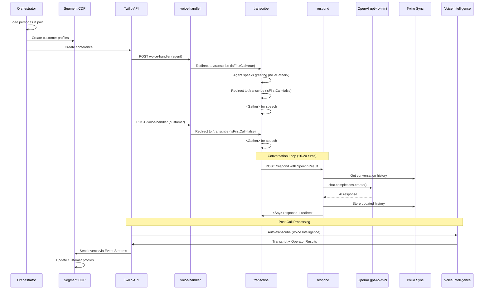

# System Architecture

## Overview

The Twilio Synthetic Call Data Generator is built on a serverless architecture using Twilio Functions, OpenAI gpt-4o-mini, and Segment CDP to create realistic customer-agent conversations with intelligent pairing and comprehensive analytics.

## High-Level Architecture

```
┌─────────────────────────────────────────────────────────────────────┐
│                         Orchestration Layer                          │
│  ┌─────────────────────────────────────────────────────────────┐   │
│  │  src/main.js - Conference Orchestrator                       │   │
│  │  • Load personas (customers + agents)                        │   │
│  │  • Intelligent pairing (complexity-based matching)           │   │
│  │  • Create Segment profiles                                   │   │
│  │  • Initiate Twilio conferences                               │   │
│  └─────────────────────────────────────────────────────────────┘   │
└──────────────────────────┬──────────────────────────────────────────┘
                           │
           ┌───────────────┼───────────────┐
           ▼               ▼               ▼
    ┌──────────┐   ┌──────────┐    ┌──────────┐
    │ Customer │   │  Agent   │    │ Segment  │
    │ Personas │   │ Personas │    │   CDP    │
    └──────────┘   └──────────┘    └──────────┘
           │               │               │
           └───────────────┴───────────────┘
                           │
                           ▼
┌─────────────────────────────────────────────────────────────────────┐
│                      Twilio Serverless Layer                         │
│  ┌──────────────┐  ┌──────────────┐  ┌──────────────┐             │
│  │voice-handler │→ │  transcribe  │→ │   respond    │             │
│  │  Conference  │  │  STT/Gather  │  │  OpenAI LLM  │             │
│  │   Routing    │  │   TwiML      │  │   Response   │             │
│  └──────────────┘  └──────────────┘  └──────────────┘             │
│         │                  │                  │                     │
│         │                  ▼                  │                     │
│         │         ┌──────────────┐            │                     │
│         │         │ Twilio Sync  │◄───────────┘                     │
│         │         │ Conversation │                                  │
│         │         │    State     │                                  │
│         │         └──────────────┘                                  │
│         ▼                                                            │
│  ┌──────────────────────────────────────────┐                      │
│  │   conference-status-webhook               │                      │
│  │   • call.completed                        │                      │
│  │   • conference.completed                  │                      │
│  │   • recording.completed                   │                      │
│  └──────────────────────────────────────────┘                      │
│         │                                                            │
│         ▼                                                            │
│  ┌──────────────────────────────────────────┐                      │
│  │   transcription-webhook                   │                      │
│  │   • Auto-transcription via Voice Intel   │                      │
│  │   • Sentiment analysis                    │                      │
│  │   • Operator results                      │                      │
│  └──────────────────────────────────────────┘                      │
└──────────────────┬──────────────────────────────────────────────────┘
                   │
                   ▼
┌─────────────────────────────────────────────────────────────────────┐
│                          Data Pipeline                               │
│  ┌──────────────┐  ┌──────────────┐  ┌──────────────┐             │
│  │   Twilio     │  │    Voice     │  │   Segment    │             │
│  │  Recording   │  │ Intelligence │  │   Profiles   │             │
│  │   Storage    │  │ Transcripts  │  │   + Events   │             │
│  └──────────────┘  └──────────────┘  └──────────────┘             │
└─────────────────────────────────────────────────────────────────────┘
```

## Call Flow Sequence



## Component Details

### 1. Orchestration Layer

**File**: `src/main.js`

**Responsibilities**:
- Load customer and agent personas from JSON
- Intelligent pairing based on issue complexity and agent competence
- Create Segment customer profiles
- Initiate Twilio conferences with both participants
- Track conference lifecycle

**Key Functions**:
```javascript
// Main workflow
loadCustomers() → loadAgents() → selectPair() →
  createSegmentProfile() → createConference() → addParticipants()
```

### 2. TwiML Functions (Twilio Serverless)

#### `/voice-handler`
**File**: `functions/voice-handler.js`

**Purpose**: Initial webhook when participant joins conference

**Flow**:
- Receives webhook from Twilio when participant joins
- Extracts role (agent/customer) and persona from conference name
- Routes to `/transcribe` with appropriate `isFirstCall` flag
  - Agent: `isFirstCall=true` (speaks first)
  - Customer: `isFirstCall=false` (listens first)

#### `/transcribe`
**File**: `functions/transcribe.js`

**Purpose**: Capture speech using `<Gather>` element

**Turn-Taking Logic**:
```javascript
if (isFirstCall === 'true' && role === 'agent') {
  // Agent first turn: speak greeting WITHOUT <Gather>
  twiml.say({ voice: 'Polly.Joanna-Neural' }, introduction);
  twiml.redirect('/transcribe?isFirstCall=false');
} else {
  // Normal turn: listen for speech WITH <Gather>
  gather = twiml.gather({
    input: 'speech',
    action: '/respond',
    speechModel: 'experimental_conversations'
  });
  gather.say({ voice: 'Polly.Joanna-Neural' }, 'Listening...');
}
```

**Key Features**:
- Speech-to-text using Twilio's speech recognition
- Automatic silence detection (`speechTimeout: 'auto'`)
- Enhanced accuracy with `experimental_conversations` model

#### `/respond`
**File**: `functions/respond.js`

**Purpose**: Process transcribed speech and generate AI response

**Flow**:
1. Receive `SpeechResult` from `/transcribe`
2. Load persona data (agent or customer characteristics)
3. Retrieve conversation history from Twilio Sync
4. Call OpenAI gpt-4o-mini with conversation context
5. Store updated conversation in Sync
6. Return TwiML with `<Say>` response
7. Redirect back to `/transcribe` for next turn

**State Management**:
- Uses Twilio Sync Documents keyed by `conferenceId`
- Stores conversation as JSON array of messages
- TTL: 1 hour (conversations auto-expire)

**Rate Limiting**:
- Checks daily call count in Sync before calling OpenAI
- Respects `MAX_DAILY_CALLS` environment variable
- Returns error message if limit exceeded

### 3. Webhook Handlers

#### `/conference-status-webhook`
**File**: `functions/conference-status-webhook.js`

**Purpose**: Handle conference lifecycle events

**Events Handled**:
- `conference.created`
- `conference.completed`
- `call.completed`
- `recording.completed`

**Actions**:
- Log conference durations
- Track participant join/leave
- Trigger post-processing workflows

#### `/transcription-webhook`
**File**: `functions/transcription-webhook.js`

**Purpose**: Receive Voice Intelligence transcripts and operator results

**Operator Results**:
- Sentiment analysis (positive/negative/neutral)
- PII extraction (names, phone numbers, emails)
- Conversation classification
- Call resolution detection

### 4. Utilities

#### `persona-loader.js`
- Fetches persona data from deployed assets
- Caches personas to reduce HTTP requests
- Builds OpenAI system prompts from persona characteristics

#### `sync-manager.js`
- Rate limiting using Sync counter
- Conversation history storage/retrieval
- Automatic TTL management

#### `webhook-validator.js`
- Validates Twilio webhook signatures
- Prevents unauthorized requests
- Uses Twilio's built-in validator

#### `error-utils.js`
- Retry logic with exponential backoff
- Circuit breaker pattern
- Structured error logging

## Data Flow

### 1. Persona Data
```
customers.json → persona-loader → OpenAI system prompt
agents.json → persona-loader → OpenAI system prompt
```

### 2. Conversation State
```
SpeechResult → respond → Sync (write)
Sync (read) → respond → OpenAI context
```

### 3. Analytics Pipeline
```
Recording → Voice Intelligence → Transcript + Operators
Event Streams → Segment CDP → Customer Profiles
```

## Security Architecture

### Webhook Signature Validation
All webhooks validate Twilio signatures using `X-Twilio-Signature` header:

```javascript
const twilioSignature = event.request.headers['x-twilio-signature'];
const isValid = twilio.validateRequest(authToken, signature, url, params);
```

### Environment Variables
- Stored in `.env` (never committed)
- Required vars validated at startup
- Secrets never logged or exposed

### Rate Limiting
- Daily call cap via `MAX_DAILY_CALLS`
- Stored in Twilio Sync (atomic increment)
- Prevents runaway OpenAI costs

## Scalability Considerations

### Current Architecture
- **Serverless**: Auto-scales with Twilio Functions
- **Stateless**: No local state, uses Sync for persistence
- **Async**: Event-driven webhooks

### Bottlenecks
- **OpenAI API**: Rate limited by OpenAI (tier-based)
- **Twilio Sync**: 100 RPS per service
- **Voice Intelligence**: Transcription is asynchronous

### Scaling Strategies
1. **Batch Processing**: Use bulk conference creation
2. **Queueing**: Add SQS/EventBridge for high-volume scenarios
3. **Caching**: Persona data is cached in memory
4. **Sharding**: Multiple Sync services for >100 RPS

## Error Handling

### Retry Logic
- Exponential backoff for transient errors
- Max 3 retries for API calls
- Circuit breaker after 5 consecutive failures

### Graceful Degradation
- Falls back to default responses if persona not found
- Returns generic message if OpenAI fails
- Continues conversation if Sync unavailable (with warning)

### Monitoring
- Error webhook: `/error-handler` for Twilio Debugger
- Structured logging for all errors
- Severity classification (CRITICAL/HIGH/MEDIUM/LOW)

## Testing Architecture

### Unit Tests (634 tests)
- Mock Twilio SDK
- Mock OpenAI responses
- Test TwiML generation
- Validate error handling

### Integration Tests
- Test webhook flows
- Validate Sync interactions
- Test persona loading

### E2E Tests
- Real Twilio calls
- OpenAI API integration
- Full conversation workflows

## Deployment Architecture

```
Local Dev → Pre-Deploy Checks → Twilio Serverless → Post-Deploy Validation

Checks:
✓ Environment variables set
✓ All tests passing
✓ Lint/format passing
✓ Persona data valid

Validation:
✓ Functions deployed
✓ Assets uploaded
✓ Webhooks responding
✓ Health check passing
```

## Future Enhancements

### Planned Features
- [ ] Real-time conversation monitoring dashboard
- [ ] Custom LLM fine-tuning for persona consistency
- [ ] Multi-language support
- [ ] Advanced emotion detection
- [ ] Call recording playback UI

### Scalability Improvements
- [ ] Redis cache for persona data
- [ ] Message queue for high-volume scenarios
- [ ] Multi-region deployment
- [ ] CDN for asset delivery

---

For implementation details, see:
- [API Documentation](api-documentation.md)
- [Deployment Guide](deployment-guide.md)
- [Error Handling Guide](error-handling-guide.md)
